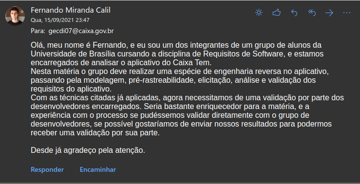

## 1. Introdução

A Validação informal se trada de buscar algum contato com os Desenvolvedores do sistema, buscando validar os artefatos de requisitos levantados pela equipe, verificar se estes artefatos estão corretos, se correspondem com a visão que os desenvolvedores têm do produto.<a href="#Bibliografia">[1]</a>

Para isso o grupo tentou se comunicar com a equipe desenvolvedora através de um e-mail, o endereço que foi utilizado é o endereço que está disponível na área da Play Store do aplicativo.

## 2. Validação Mal Sucedida

O integrante <strong>Fernando</strong> tentou entrar em contato com os desenvolvedores com a seguinte mensagem:

Infelizmente, assim como a tentativa de contato anterior, na técnica de <a href="../../Elicitacao/Tecnicas/AnalisedeDocumentos">Análise de Documentos</a>, o grupo não obteve resposta da equipe desenvolvedora.

  
## Bibliografia  

[1] - SERRANO, Maurício; SERRANO, Milene; **Requisitos - Aula 23**; Disponível em: https://aprender3.unb.br/pluginfile.php/993660/mod_resource/content/2/Requisitos%20-%20Aula%20023.pdf.  Acesso em: 16 set. 2021.

## Versionamento

| Versão | Data | Modificação | Autor |
|--|--|--|--|
| 0.1 | 17/09/2021 | Criação da página e formulação do conteúdo | Fernando Calil |

