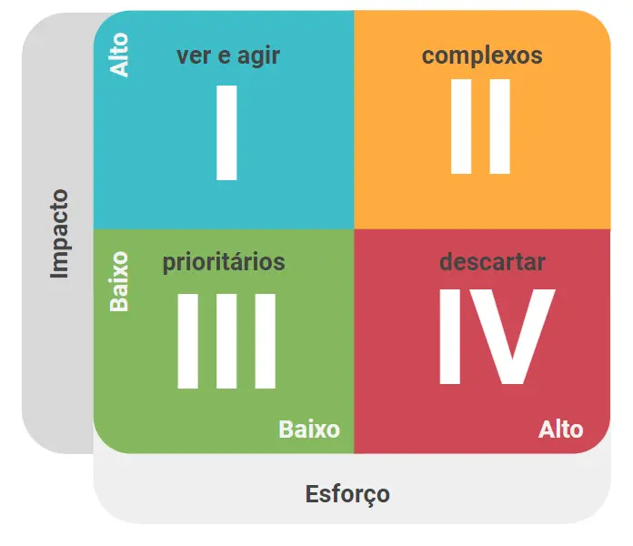
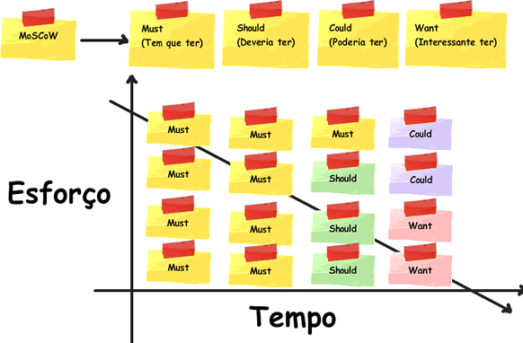

# Matriz  Esforço X Impacto
##  1. Introdução

 
A Matriz de Esforço X Impacto(tempo) é uma ferramenta para priorização de tarefas. Ela divide as atividades em 4 grupos, classificando-os de acordo com o impacto gerado e o esforço despendido em cada atividade.

 
Na figura 01 temos a matriz é dividida em dois eixos, vertical e horizontal. O primeiro bloco, que trata do impacto, leva em conta fatores financeiros e satisfação do cliente. Já o segundo bloco, esforço, considera o tempo, energia, recursos humanos que serão empregados na tarefa.

<figcaption>Figura 01 - Matriz  Esforço X Impacto. Fonte:[1] </figcaption>

 
Podemos aplicar a técnica de MoSCoW a matriz de Esforço X Impacto (tempo) assim obtendo uma prioziação em relação ao tempo o que não é possivel com o MosCow. Na figura 02 temos represtando os termos do MoSCoW - must, should, could, want - na matriz esfoço tempo.

<figcaption>Figura 02 - Matriz  Esforço X Tempo com a visão do MoSCoW.   Fonte: [2]</figcaption>

## Bibliografia 

 [1] - https://rockcontent.com/br/blog/matriz-de-esforco-x-impacto/

 [2] - https://sitecampus.com.br/wp-content/uploads/2018/06/priorizacao-1.png

## Versionamento

| Versão | Data | Modificação | Autor |
|--|--|--|--|
| 1.0 | 13/08/2021 | Criação do página | Antônio Aldisio |
| 1.0 | 13/08/2021 | Adição de contéudo | Antônio Aldisio |

