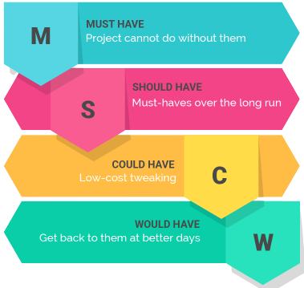

# MoSCoW

##  1. Introdução

 Após o processo de elicitação de requisitos, o time de de desenvolvimento do projeto possui uma lista com quais são as funcionalidades que o produto deve conter, neste momento é necessário que se tenha uma forma de decidir quais funcionalidades são mais importantes, que agregam mais valor para o produto, e portanto devem ser implementadas com maior prioridade, para que o time desenvolvedor possa realizar este processo de priorização são utilizadas as técnicas de priorização, nesta pagina trataremos da técnica MoSCoW.<a href="#Bibliografia">[1]</a>  

## MoSCoW

 MoSCoW é uma técnica de análise de de requisitos, que tem como objetivo de atribuir valores que indicam qual a importância de cada funcionalidade, de acordo com o valor agregado a ela em relação ao produto final.  
  
Durante o processo de priorização, cada funcionalidade é avaliada com relação a sua importância e recebe uma atribuição que pode ser:

- **M**ust: Funcionalidade tem alto valor agregadom, se o produto não contiver esta funcionalidade ele não terá sucesso, deve ter prioridade sobre as outras no processo de implementação.
- **S**hould: Requisito que tem importância mas não é essencial, caso não seja implementado impactará a satisfação do cliente.
- **C**ould: Requisito que é apenas desejável para o produto, requisito que deve ser implementado somente se ouver tempo e os recursos permitam.
- **W**ould ou **W**on't: Requisito dispensável, que pode ser adicionado em outro momento ou até mesmo em outros projetos, mesmo que seja marcado como não importante a atribuição ainda indica que a funcionalidade foi avaliada.<a href="#Bibliografia">[1]</a>  
    

<figcaption class="center"> Figura 1 - Descrição de cada prioridade. </figcaption>

## Bibliografia  

[1] - VAZQUEZ, Carlos Eduardo; SIMÕES, Guilherme Siqueira; **Engenharia de Requisitos**: Software orientado ao negócio. 1. ed. Brasil: Brasport, 2016. 

## Versionamento

| Versão | Data | Modificação | Autor |
|--|--|--|--|
| 1.0 | 13/08/2021 | Criação do página | Antônio Aldisio |
| 1.1 | 19/08/2021 | Adição de conteúdo teórico | Fernando Calil |

