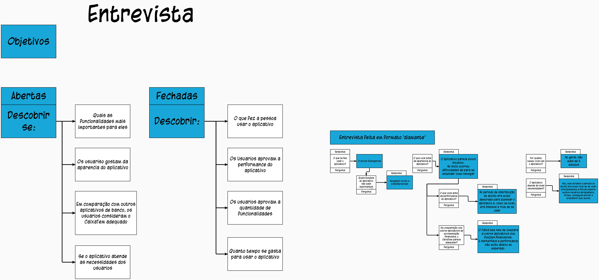
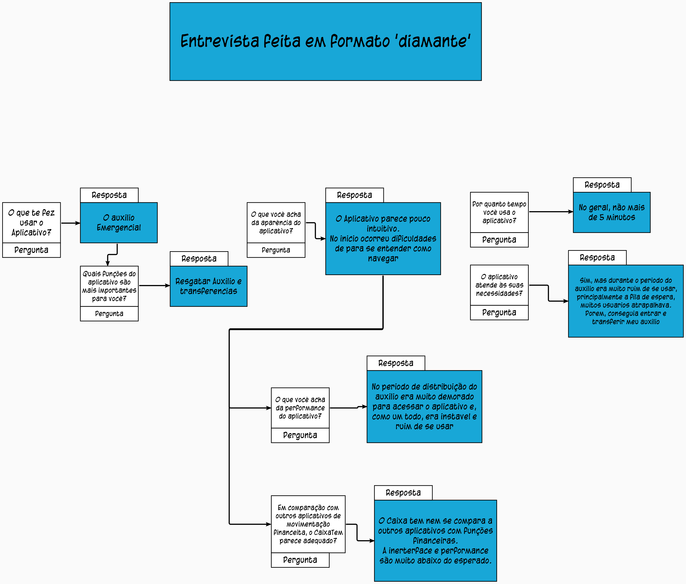

# Entrevista

## 1. Introdução
Para a Entrevista, organizei as perguntas no formato 'diamante', em que se incia com perguntas fechadas, passa para uma etapa de perguntas abertas, e termina com perguntas fechadas. 
O objetivo é iniciar contextualizando o entrevistado e então buscar informações mais subjetivas, com o intuito de se encontrar requisitos não funcionais.

## 2. Esqueme Diamante

<figcaption>Figura 01 - Organização da entrevista no estilo diamante </figcaption>

<figcaption>Figura 01 - Organização da entrevista no estilo diamante </figcaption>

## 3. Bibliografia

Engenharia de Requisitos,Carlos Eduardo Vazquez, Guilherme Siqueira Simões.

## 4. Requisitos Funcionais

| ID | Requisito | 
|:--:|:--:|
| RF 1 |Selecionar funções favoritas|
| RF 02 |O usuario pode verificar situação de auxilios |
| RF 03 |O usuario pode sacar auxilios | 
| RF 04 |O usuario pode transferir dinheiro|
| RF 05 |O usuario pode consultar saldo|
| RF 06 |O usuario pode pagar contas e boletos|
| RF 07 |O usuario pode fazer comprar usando maquinas de transfência (maquininha)|
| RF 08 |O usuario pode utilizar um cartão de debito virtual|

## 5. Requisitos Não - Funcionais

| ID | Requisito | 
|:--:|:--:|
| NF 01|Menor tempo de espera para entrar em aplicativo durante periodos de grande fluxo|
| NF 02|Ter acessibilidade com comandos por voz|
| NF 03|Ter a opção de guia para primeiro acesso|
| NF 04|Possuir interface intuitiva|

## Versionamento

| Versão | Data | Modificação | Autor |
|--|--|--|--|
| 1.0 | 17/08/2021 | Criação do página | Antônio Aldisio |
| 2.0 | 21/08/2021 | Resultados da entrevista | Ariel Serafim |
| 2.1 | 21/08/2021 | Correção de tabela | Antônio Aldisio |
| 2.2 | 24/08/2021 | Inserção da Bibliografia, imagem e mais requisitos| Ariel Serafim |
| 3.0 | 29/08/2021 | Revisão geral, imagens melhores e mais requisitos| Ariel Serafim |

