# Questionário
## 1. Introdução

 O questionário é uma técnica que permite a rápida obtenção de informações quantitativas e qualitativas de um público-alvo numeroso. Quando aplicada a uma amostra representativa do público, permite representar as opiniões de toda a população.

É uma técnica relativamente rápida e barata de ser aplicada e é muito útil quando a o público-alvo está disperso geograficamente.<a href="#Bibliografia">[1]</a> 

## 2. Metodologia

O questionário foi elaborado pelos membros Lucas Gomes e Matheus Salim e posteriormente revisado por Ugor Costa. O questionário possui perguntas relacionadas ao uso do aplicativo e perguntas genéricas com o intuito de descobrir o perfil dos usuários.

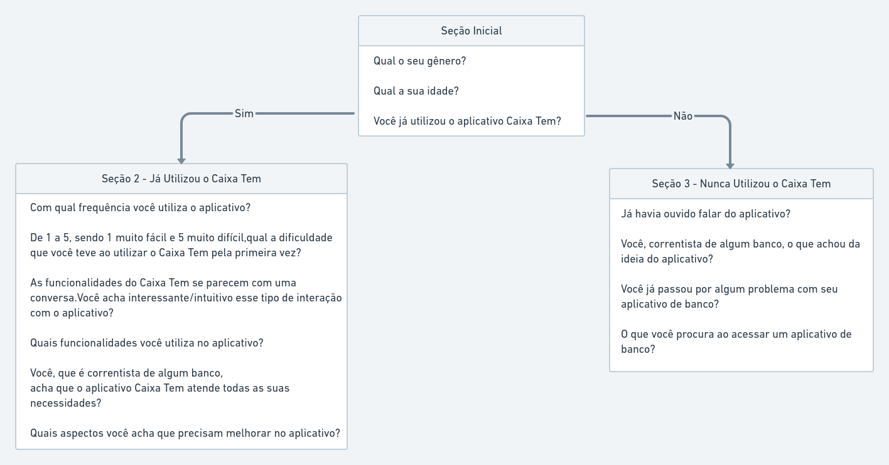
<figcaption>Figura 01 - Diagrama Representativo do Questionário</figcaption>

## 3. Resultado do Questionário

O questionário foi aplicado entre os dias 17/08/2021 e 19/08/2021 e obteve 20 respostas. Os dados obtidos podem ser analisados a seguir:

### 3.1. Seção Inicial
#### Questão 1
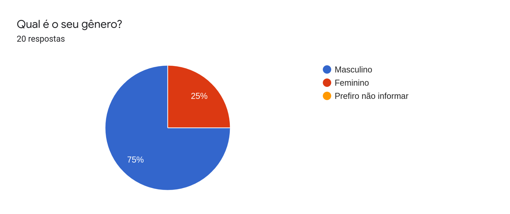
<figcaption>Figura 02 - Questão sobre o gênero do entrevistado</figcaption>

#### Questão 2
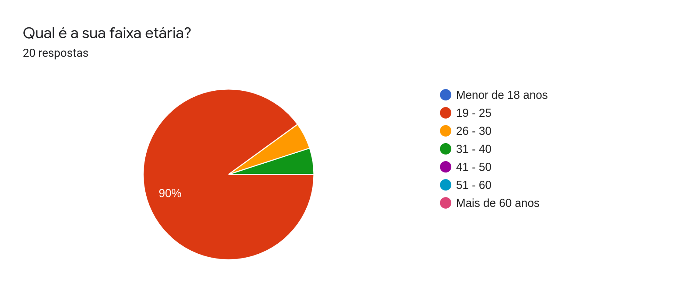
<figcaption>Figura 03 - Questão sobre a idade do entrevistado</figcaption>

#### Questão 3
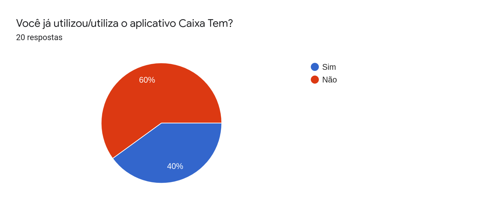
<figcaption>Figura 04 - Questão perguntando se o entrevistado já utilizou o aplicativo</figcaption>

### 3.2. Seção 2 - Já utilizou o Caixa Tem

#### Questão 4
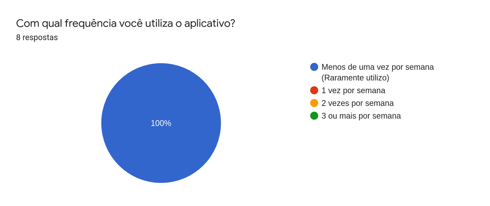
<figcaption>Figura 05 - Questão sobre a frequência de uso do app</figcaption>

#### Questão 5
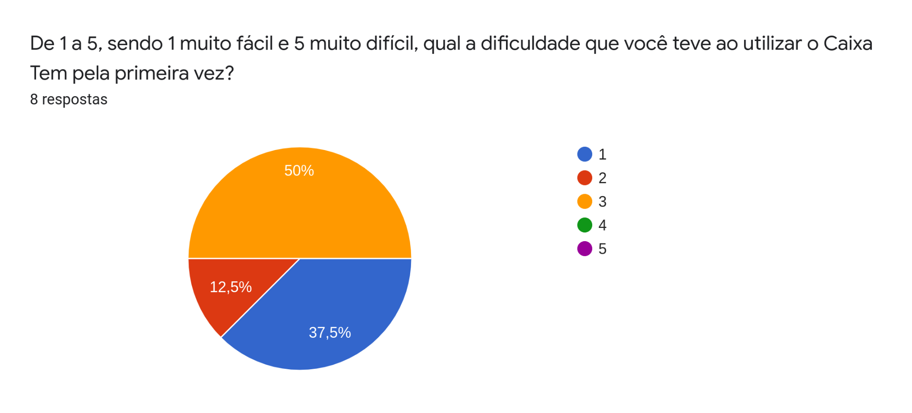
<figcaption>Figura 06 - Questão sobre a dificuldade do entrevistado ao usar o app pela 1º vez</figcaption>

#### Questão 6
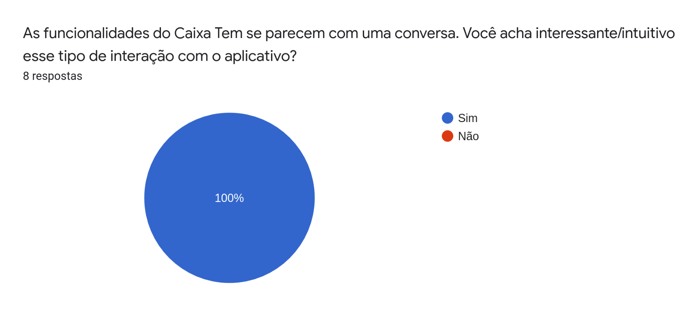
<figcaption>Figura 07 - Questão sobre as funcionalidades se parecerem com uma conversa</figcaption>

#### Questão 7
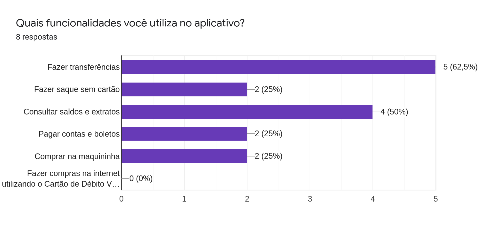
<figcaption>Figura 08 - Questão sobre as funcionalidades utilizadas pelo usuário</figcaption>

#### Questão 8
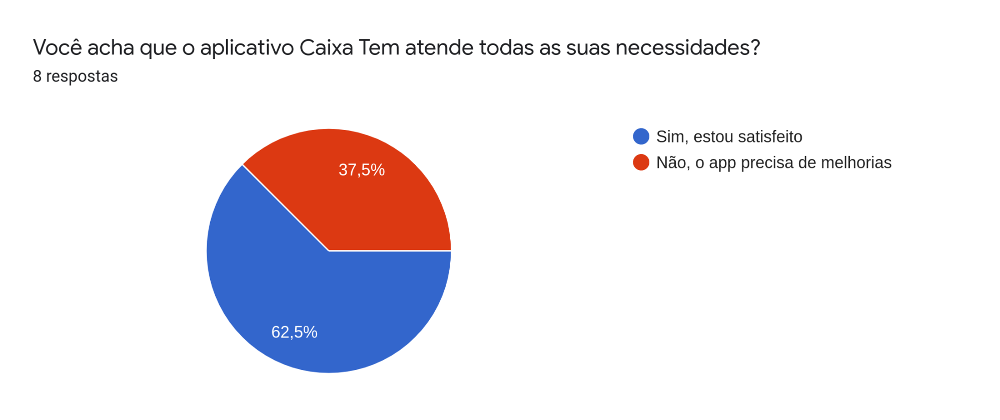
<figcaption>Figura 09 - Questão perguntando se o app atende todas as necessidades</figcaption>

#### Questão 9
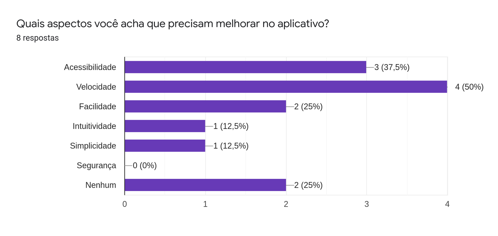
<figcaption>Figura 10 - "Questão sobre os aspectos que precisam melhorar no app"</figcaption>

### 3.3. Seção 3 - Nunca utilizou o Caixa Tem

Essa seção inicia com um breve texto explicando sobre o Caixa Tem e suas funcionalidades.

#### Questão 10
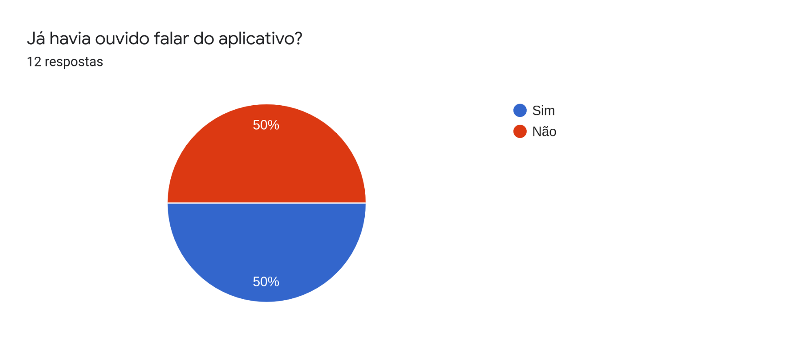
<figcaption>Figura 11 - Questão perguntando se o entrevistado já ouviu falar do app</figcaption>

#### Questão 11
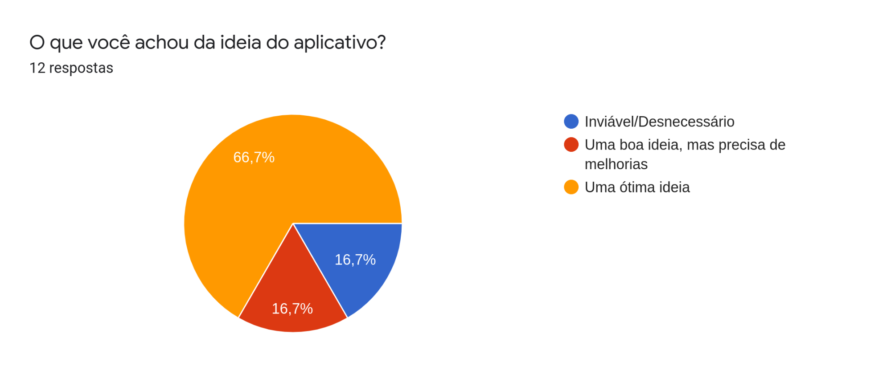
<figcaption>Figura 12 - Questão sobre o que o entrevistado achou da ideia do app</figcaption>

#### Questão 12
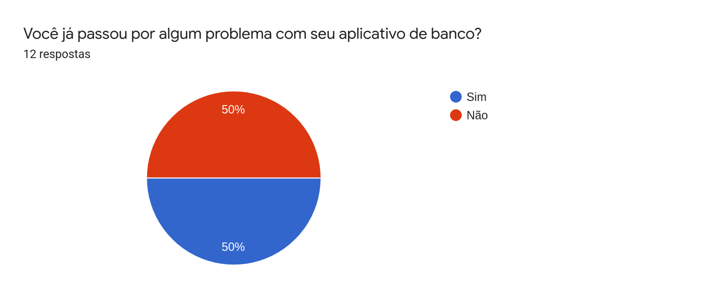
<figcaption>Figura 13 - Questão sobre problemas em outros aplicativos de banco</figcaption>

#### Questão 13
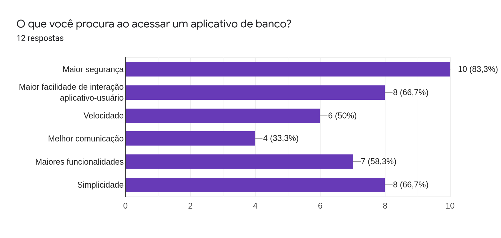
<figcaption>Figura 14 - Questão sobre o que o entrevistado procura em um aplicativo de banco</figcaption>

### 3.4. Conclusão

 A partir dos resultados obtidos, percebeu-se que a maioria dos usuários utilizam o aplicativo principalmente para realizar transferências e consultat saldos e extratos e acham que os aspectos mais problemáticos são a velocidade e acessibilidade. Também foi possível chegar a conclusão de que um aplicativo de banco seguro, intuitivo e com uma interface simples é o mais desejado por usuários. 

## 4. Requisitos Funcionais

| ID | Requisito | 
|--|--|
| RF 01 | O usuário pode realizar transferências | 
| RF 02 | O usuário pode consultar seu saldo | 
| RF 03 | O usuário pode consultar seus extratos | 
| RF 04 | O usuário pode fazer saque sem cartão | 
| RF 05 | O aplicativo deve gerar um código para saque | 
| RF 06 | O usuário deve ser capaz de pagar suas contas e boletos | 
| RF 07 | O usuário deve ser capaz de comprar na maquininha | 
| RF 08 | O usuário pode realizar compras na internet com cartão de débito virtual | 

## 5. Requisitos Não - Funcionais
| ID | Requisito | 
|--|--|
| RNF 01 | O aplicativo deve manter os dados do usuário em segurança | 
| RNF 02 | O aplicativo deve possuir uma interface simples | 
| RNF 03 | O aplicativo deve ser veloz e eficiente | 
| RNF 04 | O aplicativo deve ser intuitivo | 
| RNF 05 | O aplicativo deve ser acessível a pessoas com deficiência | 
| RNF 06 | As funcionalidades do aplicativo devem se parecer com uma conversa | 
| RNF 07 | O código de segurança gerado para realizar compras com cartão de débito virtual deve ser válido para apenas uma compra | 

## 6.Bibliografia 

 [1] VAZQUEZ, Carlos Eduardo; SIMÕES, Guilherme Siqueira. Engenharia de Requisitos: Software Orientado ao Negócio. Rio de janeiro: Brasport, 2016.

## Versionamento

| Versão | Data | Modificação | Autor |
|--|--|--|--|
| 1.0 | 13/08/2021 | Criação do página | Antônio Aldisio |
| 1.1 | 15/08/2021 | Adição da introdução e conteúdo do questionário | Lucas Gomes |
| 1.2 | 20/08/2021 | Adição dos resultados do questionário | Lucas Gomes |
| 1.3 | 26/08/2021 | Adição das legendas nas figuras | Lucas Gomes |

