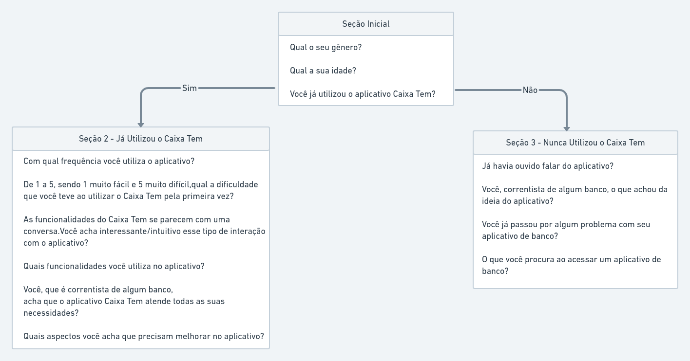

# Questionario
## 1.Introdução

 O questionário é uma técnica que permite a rápida obtenção de informações quantitativas e qualitativas de um público-alvo numeroso. Quando aplicada a uma amostra representativa do público, permite representar as opiniões de toda a população.

É uma técnica relativamente rápida e barata de ser aplicada e é muito útil quando a o público-alvo está disperso geograficamente.<a href="#Bibliografia">[1]</a> 

## 2.Metodologia

O questionário foi elaborado pelos membros Lucas Gomes e Matheus Salim e posteriormente revisado por Ugor Costa. O questionário possui perguntas relacionadas ao uso do aplicativo e perguntas genéricas com o intuito de descobrir o perfil dos usuários.

<figcaption>Figura 01 - Diagrama Representativo do Questionário</figcaption>

## Bibliografia 

 [1] VAZQUEZ, Carlos Eduardo; SIMÕES, Guilherme Siqueira. Engenharia de Requisitos: Software Orientado ao Negócio. Rio de janeiro: Brasport, 2016.

## 3. Requisitos Funcionais

| ID | Requisito | 
|--|--|
| RF 01 |  | 

## 4. Requisitos Não - Funcionais
| ID | Requisito | 
|--|--|
| RNF 01 |  | 

## Versionamento

| Versão | Data | Modificação | Autor |
|--|--|--|--|
| 1.0 | 13/08/2021 | Criação do página | Antônio Aldisio |
| 1.1 | 15/08/2021 | Adição da introdução e conteúdo do questionário | Lucas Gomes |

