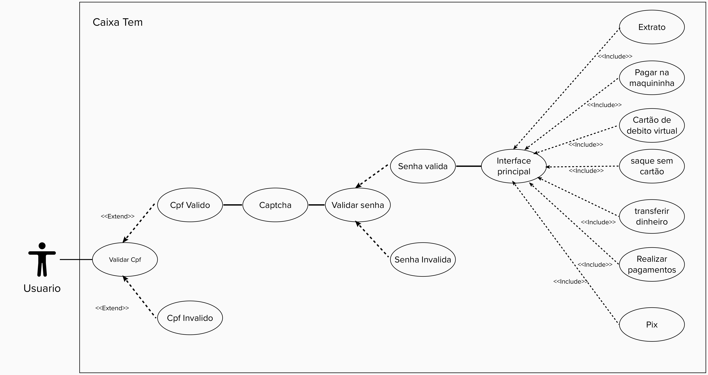

## Introdução.
O diagrama de casos de uso é uma representação visual estabelecida dentro dos protocolos UML(Unified Modeling Language) que ilustra as funções esperadas do sistema e seus atores.

## Atores.
Os atores são entidades que interagem com o sistema, mas não fazem parte do sistema.
Para o Aplicativo CaixaTem, há apenas um Ator, o usuario do aplicativo, mesmo que existam opções de transferência entre aplicativos, opções de saque e depositos, somente o usuario logado no aplicativo fornece as informações necessárias para realizar as funções, e somente o usuario logado no sistema recebe informações requisitadas ao aplicativo.

## Diagrama de Caso de Uso.

<figcaption>Figura 01 - Organização da entrevista no estilo diamante </figcaption>

## Descrição dos Casos de Uso.
Verificamos a existencia de apenas um caso de uso, com diversos fluxos alternativos.

### 1 Nome do Caso de Uso :
Acesso ao aplicativo com uso de função.

### 2 Breve descrição:
Acesso do usuário no aplicativo, informe de todos os dados e porteriormente uso de uma ou mais funcionalidades.

### 3 Fluxo de eventos
Como citado anteriormente, há um fluxo básico com alguns fluxos alternativos.

#### 3.1 Fluxo básico

O caso de uso começa quando o ator informa que deseja acessar o sistema com o CPF pré cadastrado no Caixa Tem. Uma nova tela do sistema solicita o CPF e o campo ‘captcha’ para avaliação.
O ator informa a senha ao sistema.
O ator acessa o programa e escolhe a opção que deseja no aplicativo

#### 3.2 Fluxos alternativos 
##### 3.2.1-Extrato
O ator é apresentado ao extrato bancário de sua conta no aplicativo do Caixa Tem, onde poderá visualizar 
movimentações que foram realizadas.

##### 3.2.2-Pagar na maquininha
Na tela do celular do ator aparecerá para escanear um QR code informado pela maquina de cartão, assim feito, a compra será feita utilizando o saldo na sua conta bancária.

##### 3.2.3-Cartão de Débito Virtual
Na tela aparecerá uma espécie de cartão, informando o código do cartão, junto com sua validade,senha,CVC. Para que assim possa realizar compras preferencialmente online, sem precisar de sacar ou transferir o dinheiro.

##### 3.2.4-Saque sem cartão
Na tela o autor será apresentado a apertar um botão “Gerar código para saque”, depois de clicar, o sistema pede a confirmação da operação e logo após a senha do aplicativo para gerar o código. Logo o código será apresentado na tela , onde com ele, o ator se dirige ao caixa eletrônico de preferência e poderá sacar o dinheiro sem a necessidade de um cartão físico.

##### 3.2.5-Transferir dinheiro
Na tela o autor será apresentado as opções:
* Digitar agência e conta.\\
* Ler QR code.\\
* Transferir para favorito.\\

Descritas a seguir:

###### Digitar agência e conta
O sistema solicitará ao ator o número da agência e conta da pessoa que ele quer transferir o dinheiro.Após informar os dígitos, o sistema pergunta qual o tipo de conta o ator quer transferir o dinheiro. Seleciona o valor para transferência desejado e confirma a operação.Ao final aparecerá uma pagina confirmando os dados e informando a operação.

###### Ler QR code
O sistema aparecerá uma página para escanear o QR code fornecido pelo banco que deseja transferir a conta. Logo solicitará a confirmação e finalização da operação.

###### Transferir para favorito
O ator  transfere o dinheiro para uma conta que já havia sido pré-cadastrada pelo ator anteriormente . Realizando os mesmos processos de confirmação e finalização anteriores

##### 3.2.6-Realizar pagamentos
O ator realiza pagamentos de boleto selecionando uma das opções:
* Com código de barras.\\
* Sem código de barras.\\
###### 3.2.6.1 - Com código de barras
O ator escaneia o código de barras do boleto para pagamento. Logo ele é apresentado as informações de pagamento para confirmação utilizando sua senha do Caixa Tem.

###### 3.2.6.2 - Sem código de barras
O ator fornece os números do boleto para pagamento.Logo ele é apresentado as informações de pagamento para confirmação utilizando sua senha do Caixa Tem.

##### 3.2.7-Pix

O ator realiza a transferência por meio do pix informando a chave necessária para realizar tal operação. Logo após realizar, o ator informa o valor desejado e confirma a operação e os dados necessários utilizando a senha do Caixa Tem.

### 4 Requisitos Especiais
Não se aplica

### 5 Pré-condições
O ator deve estar logado no sistema. Nenhum outro usuário com o mesmo CPF
deve ter sido cadastrado.

### 6 Pós-condições
O usuário foi conectado e saiu do sistema ou realizou uma ou mais tarefas disponibilizadas pelo aplicativo.

### 7 Pontos de Extensão
Não se aplica.

## Bibliografia 
[1] Pimentel, Andrey Ricardo; . Projeto de Software Usando a UML. Apostila para Curso de Projeto de Sistemas Orientado a Objeto. Disponível em https://www.inf.ufpr.br/andrey/ci163/apostilaUml.pdf Acessado em 29/08/21 

## Versionamento

| Versão | Data | Modificação | Autor |
|--|--|--|--|
| 1.0 | 01/08/2021 | Criação da página | Fernando Calil |
| 2.0 | 29/08/2021 | Descrição dos casos de uso | Ariel Serafim |
| 2.1 | 30/08/2021 | Diagrama de Caso de uso | Ariel Serafim |
| 2.2 | 30/08/2021 | Revisão da descrição dos casos de uso | Ariel Serafim |

