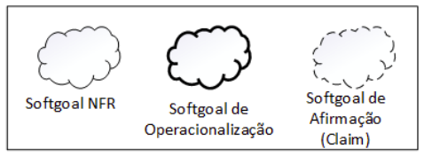
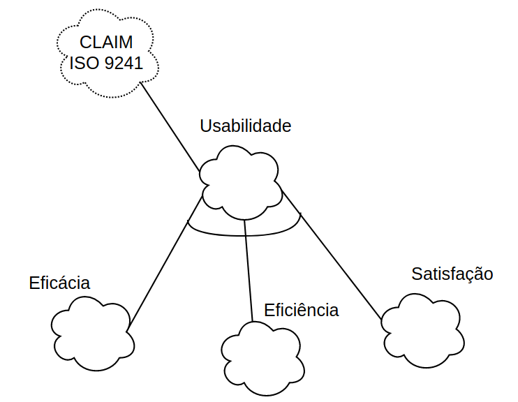
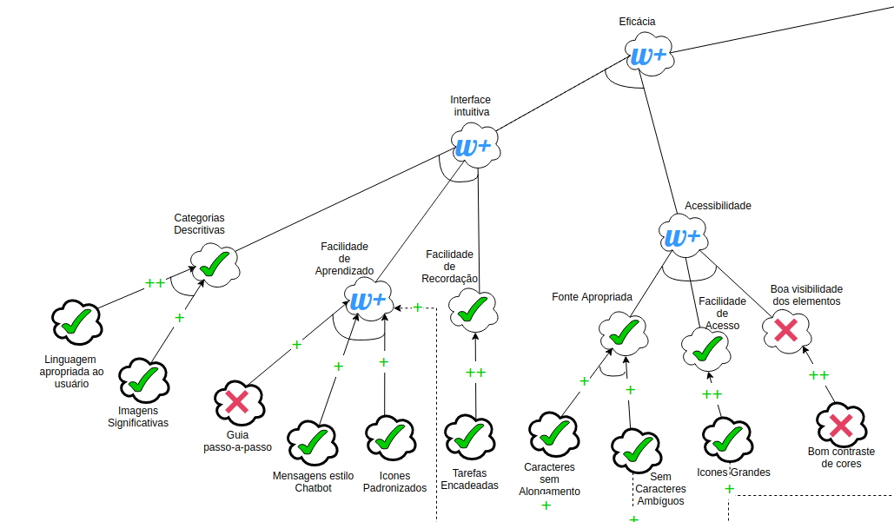

# NFR Framework

## 1. Introdução

Existem muitas formas de se representar e analisar requisitos não funcionais (NFR), dentre elas vale citar as árvores de qualidade de software, a técnica FURPS +, e a classificação feita pela “standard ISO/IEC 9126”. Essas classificações são úteis para a questão de análise de NFR, entretanto, há uma falta de consistência entre elas.

No artigo escrito pelos cientistas da computação Lawrence Chung e Julio Cesar Sampaio do Prado, em que é descrito o NFR Framework, eles argumentam sobre como alguns aspectos são tratados de forma diferente entre essas técnicas clássicas, mas sem uma concordância entre elas. O principal diferencial do NFR Framework é descrever um procedimento consistente para modelar os NFR elicitados em uma unidade denominada “Softgoal”, e analisar esses softgoals e suas relações de maneira que a equipe de desenvolvimento pode determinar se os softgoals foram satisfeitos ou não.<a href="../NFR_Framework#Bibliografia">[1]</a> 

## 2. Softgoals

Utilizado pelo NFR Framework, um softgoal é um objetivo que não possui uma clara definição nem critérios de satisfação precisos. Os softgoals são utilizados para representar Requisitos Não-Funcionais e podem estar inter-relacionados, expressando a influência de
um softgoal em outro.<a href="../NFR_Framework#Bibliografia">[2]</a> 

Existem 3 tipos de softgoals. São eles:

<ul style="margin-left:50px">
    <li><strong>Softgoals NFR :</strong> representam os Requisitos Não- Funcionais e podem estar interrelacionados, organizados em catálogos e apresentados de forma hierárquica no desenvolvimento do projeto (CHUNG et al., 2000).</li>
    <li><strong>Softgoals de Operacionalização :</strong> representam soluções de implementação para
    satisfazer softgoals NFR ou outros softgoals de operacionalização (CHUNG et al., 2000).</li>
    <li><strong>Softgoals de Afirmação :</strong> permitem que as características do domínio (como prioridades e carga de trabalho) sejam consideradas e devidamente refletidas no processo de tomada de decisão.  (CHUNG et al., 2000).</li>
</ul>

<figcaption> Figura 01 - Tipos de Softgoals <a href="../NFR_Framework#Bibliografia">[2]</a></figcaption>

É possível utilizar, no NFR Framwork, diversos tipos de contribuições para descrever como a satisfação ou não de um softgoal descendente irá contribuir para a satisfação do softgoal ascendente.<a href="../NFR_Framework#Bibliografia">[2]</a> Os tipos de contribuição são: 

Contribuição | Descrição
-|-
AND | Estabelece que os softgoals ascendentes serão satisfeitos se os softgoals descendentes forem satisfeitos.
OR | Se algum softgoal descendente for satisfeito, então o ascendente também será.
MAKE(++) | Fornece uma contribuição suficientemente positiva entre um softgoal descendente e um ascendente.
BREAK(--) | Fornece uma contribuição suficientemente negativa entre um softgoal descendente e um ascendente.
HELP(+) | Fornece uma contribuição parcialmente positiva entre um softgoal descendente e um ascendente.
HURT(-) | Fornece uma contribuição parcialmente negativa entre um softgoal descendente e um ascendente.
UNKNOWN(?) | Fornece uma contribuição desconhecida entre um softgoal descendente e um ascendente.
EQUALS | O softgoal descendente será satisfeito somente se o softgoal ascendente for satisfeito e o softgoal descendente será negado se o ascendente for negado.
SOME (+\|-) | Utilizada quando o sinal de contribuição é conhecido,mas a extensão não é.

O procedimento de avaliação determina o grau que os requisitos não funcionais são satisfeitos por um conjunto de decisões. Para isso, são atribuídos rótulos para os softgoals.<a href="../NFR_Framework#Bibliografia">[2]</a> 

<figcaption> Figura 02 - Tipos de rótulos utilizados pelos Softgoals <a href="../NFR_Framework#Bibliografia">[2]</a></figcaption>

## 3. NFR e os Softgoals

Segue abaixo uma relação dos softgoals referentes aos requisitos não funcionais elicitados para o projeto.

| ID | Requisito |  Origem | Softgoals | 
|:--:|:--:|:--:|:--:|
| RNF 01 | O aplicativo deve ter compatibilidade com qualquer sistema operacional | <a href="../../Elicitacao/Tecnicas/brainstorm#BrainstormingNFuncional">BNF01</a> | Portabilidade |
| RNF 02 | O sistema deve recusar o acesso de pessoas não autorizadas | <a href="..Elicitacao/Tecnicas/inpeccao#IntrospecçãoNFuncional">INF04</a>, <a href="../..Elicitacao/Tecnicas/brainstorm#BrainstormingNFuncional">BNF02</a>  | Segurança |
| RNF 03 | As funcionalidades devem se parecer com uma conversa (chatbot) | <a href="../..Elicitacao/Tecnicas/questionario#QuestionarioNFuncional">QNF03</a>, <a href="../..Elicitacao/Tecnicas/storytelling#StorytellingNFuncional">SNF02</a>, <a href="../..Elicitacao/Tecnicas/brainstorm#BrainstormingNFuncional">BNF04</a>  | Acessibilidade |
| RNF 04 | O aplicativo não pode ter grande espaço de armazenamento. | <a href="../..Elicitacao/Tecnicas/inpeccao#IntrospecçãoNFuncional">INF01</a> | Desempenho |
| RNF 05 | O aplicativo não pode ficar indisponível por mais que 10 minutos por dia. | <a href="../..Elicitacao/Tecnicas/inpeccao#IntrospecçãoNFuncional">INF02</a>, <a href="../..Elicitacao/Tecnicas/storytelling#StorytellingNFuncional">SNF03</a>   | Disponibilidade |
| RNF 06 | O aplicativo não pode apresentar dados de cunho privativo que não seja do próprio usuário. | <a href="../..Elicitacao/Tecnicas/inpeccao#IntrospecçãoNFuncional">INF03</a>  | Segurança |
| RNF 07 | O usuários devem conseguir encontrar a funcionalidade desejada em menos que três clicks. | <a href="../..Elicitacao/Tecnicas/inpeccao#IntrospecçãoNFuncional">INF05</a>  | Usabilidade |
| RNF 08 | O aplicativo deve se comunicar com o banco de dados.| <a href="../..Elicitacao/Tecnicas/inpeccao#IntrospecçãoNFuncional">INF06</a>  | Usabilidade e Segurança |
| RNF 09 | O aplicativo deve proteger os dados dos usuários.| <a href="../..Elicitacao/Tecnicas/questionario#QuestionarioNFuncional">QNF01</a>, <a href="../..Elicitacao/Tecnicas/inpeccao#IntrospecçãoNFuncional">INF07</a>, <a href="../..Elicitacao/Tecnicas/storytelling#StorytellingNFuncional">SNF05</a>  | Segurança |
| RNF 10 | O aplicativo deve ser desenvolvido em uma linguagem que tenha uma comunidade ativa e/ou que não tenha previsão de descontinuade da linguagem nos próximos 5 anos.| <a href="../..Elicitacao/Tecnicas/inpeccao#IntrospecçãoNFuncional">INF08</a>  | Portabilidade e Disponibilidade |
| RNF 11 | O usuário não pode ficar mais de 15 minutos em fila para acessar o aplicativo. | <a href="../..Elicitacao/Tecnicas/storytelling#StorytellingNFuncional">SNF01</a> | Desempenho |
| RNF 12 | O sistema deve ser acessível para Pessoas com Deficiência (PcD) | <a href="../..Elicitacao/Tecnicas/questionario#QuestionarioNFuncional">QNF02</a>, <a href="../..Elicitacao/Tecnicas/entrevista#EntrevistaNFuncional">ENF02</a>, <a href="../..Elicitacao/Tecnicas/brainstorm#BrainstormingNFuncional">BNF03</a> | Acessibilidade |
| RNF 13 |  O código de segurança gerado para realizar compras com cartão de débito virtual deve ser válido para apenas uma compra | <a href="../..Elicitacao/Tecnicas/questionario#QuestionarioNFuncional">QNF04</a> | Segurança |
| RNF 14 |  Ter a opção de guia para primeiro acesso | <a href="../..Elicitacao/Tecnicas/entrevista#EntrevistaNFuncional">ENF03</a>, <a href="../..Elicitacao/Tecnicas/observacao#ObservaçãoNFuncional">ONF01</a>| Acessibilidade |

### 3.1 Diagrama NFR Geral

<body>

</body>

#### 3.1.1 Diagrama NFR Usabilidade

#### 3.1.2 Diagrama NFR Eficácia

#### 3.1.3 Diagrama NFR Eficiência

#### 3.1.4 Diagrama NFR Satisfação

### 3.2 Diagrama NFR com propagação

<body>

</body>

#### 3.2.1 Diagrama NFR com propagação da Eficácia

#### 3.2.2 Diagrama NFR com propagação da Eficiência

#### 3.2.2 Diagrama NFR com propagação da Satisfação

## Bibliografia 
[1] CHUNG, L.; NIXON, B. A.; YU, E.; MYLOPOULOS, J. Non-functional requirements
in software engineering. Springer Science & Business Media: [s.n.], 2000. v. 5. Disponível <a href="http://www-di.inf.puc-rio.br/~julio/nfr-chung-leite.pdf">aqui.</a> Acessado em 03/09/21. 

[2] DA SILVA, Reinaldo Antônio. NFR4ES: Um Catálogo de Requisitos Não-Funcionais para Sistemas Embarcados. 2019. Dissertação (Mestrado em Ciência da Computação) - Universidade Federal de Pernambuco, Recife, 2019.

## Versionamento

| Versão | Data | Modificação | Autor |
|--|--|--|--|
| 1.0 | 03/09/2021 | Criação da págia e Introdução | Ariel Serafim |
| 2.0 | 04/09/2021 | Melhoria no layout e adição dos tipos de softgoals | Lucas Gomes |
| 3.0 | 04/09/2021 | Adição dos tipos de contribuição e tipos de rótulos | Lucas Gomes |
| 4.0 | 09/09/2021 | Adição da tabela relacionando NFR e softgoals | Ariel Serafim |
| 5.0 | 11/09/2021 | Adicionados diagramas NFR com e sem propagação | Fernando Calil |

