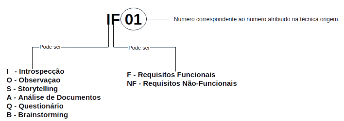

# Matriz Backward-From

## 1. Introdução

 A rastreabilidade de requisitos pode ser vista como a habilidade de acompanhar e descrever a vida de um requisito <a href="#Bibliografia">(Davis, 93)</a>. Assim a rastreabilidade de um requisito pode ser representada em duas direções, para frente, onde se ligam os documentos obtidos na elicitação aos requisitos relevantes, e para trás, que liga os requisitos às suas fontes.<a href="#Bibliografia">(Leite, 2005)</a>

 Nesta página trataremos da ratreabilidade backwars-from(para trás), onde representamos todos os requisitos elencados para o produto de software analisado, e ligamos esses resultados às técnicas que deram origem a eles. 

 A tabela que representa a rastreabilidade contém três colunas, ID que lista os códigos associados aos requisitos, sendo RF para Requisitos Funcionais, e RNF para Requisitos Não-Funcionais, a coluna de requisito, onde são listados os requisitos do produto, e por fim a coluna de origem, onde são listadas as técnicas que deram origem aquele requisito, nesta são atribuídos códigos que correspondem a cada categoria, estas representações são descritas na <a href="#Legenda">Figura 01</a>.

<Figure>
    
    <figcaption>Figura 01 - Legenda da rastreabilidade. </figcaption>
</Figure>

## 2. Requisitos Funcionais

| ID | Requisito | Origem |
|:--:|:--:|:--:|
| RF 01 | O usuário deve ser capaz de realizar cadastro | <a href="../../Elicitacao/Tecnicas/brainstorm#BrainstormingFuncional">BF01</a>, <a href="../../Elicitacao/Tecnicas/observacao#ObservaçãoFuncional">OF1</a>, <a href="../../Elicitacao/Tecnicas/storytelling#StorytellingFuncional">SF01</a> | 
| RF 02 | O usuário deve ser capaz de realizar login | <a href="../../Elicitacao/Tecnicas/inpeccao#IntrospecçãoFuncional">IF01</a>, <a href="../../Elicitacao/Tecnicas/storytelling#StorytellingFuncional">SF02</a>, <a href="../../Elicitacao/Tecnicas/brainstorm#BrainstormingFuncional">BF02</a>, <a href="../../Elicitacao/Tecnicas/observacao#ObservaçãoFuncional">OF02</a> |  
| RF 03 | O usuário pode realizar pagamentos | <a href="../../Elicitacao/Tecnicas/storytelling#StorytellingFuncional">SF08</a>, <a href="../../Elicitacao/Tecnicas/brainstorm#BrainstormingFuncional">BF03</a> | 
| RF 04 | O usuário pode realizar pagamentos via boletos | <a href="../../Elicitacao/Tecnicas/questionario#QuestionarioFuncional">QF06</a>, <a href="../../Elicitacao/Tecnicas/entrevista#EntrevistaFuncional">EF06</a>, <a href="../../Elicitacao/Tecnicas/inpeccao#IntrospecçãoFuncional">IF04</a> | 
| RF 05 | O usuário pode realizar pagamentos via PIX | <a href="../../Elicitacao/Tecnicas/inpeccao#IntrospecçãoFuncional">IF05</a>, <a href="../../Elicitacao/Tecnicas/observacao#ObservaçãoFuncional">OF09</a> | 
| RF 06 | O usuário tem que ser capaz de pagar praticamente qualquer tipo de conta nas Unidades Lotéricas| <a href="../../Elicitacao/Tecnicas/inpeccao#IntrospecçãoFuncional">IF16</a> | 
| RF 07 | O usuário pode consultar saldo | <a href="../../Elicitacao/Tecnicas/questionario#QuestionarioFuncional">QF02</a>, <a href="../../Elicitacao/Tecnicas/entrevista#EntrevistaFuncional">EF05</a>, <a href="../../Elicitacao/Tecnicas/inpeccao#IntrospecçãoFuncional">IF03</a>, <a href="../../Elicitacao/Tecnicas/storytelling#StorytellingFuncional">SF06</a>, <a href="../../Elicitacao/Tecnicas/brainstorm#BrainstormingFuncional">BF04</a>, <a href="../../Elicitacao/Tecnicas/observacao#ObservaçãoFuncional">OF03</a> | 
| RF 08 | O usuário pode consultar o extrato | <a href="../../Elicitacao/Tecnicas/questionario#QuestionarioFuncional">QF03</a>, <a href="../../Elicitacao/Tecnicas/inpeccao#IntrospecçãoFuncional">IF02</a>, <a href="../../Elicitacao/Tecnicas/storytelling#StorytellingFuncional">SF07</a>, <a href="../../Elicitacao/Tecnicas/brainstorm#BrainstormingFuncional">BF05</a>, <a href="../../Elicitacao/Tecnicas/observacao#ObservaçãoFuncional">OF04</a> | 
| RF 09 | O sistema deve gerar cartão de débito virtual | <a href="../../Elicitacao/Tecnicas/questionario#QuestionarioFuncional">QF08</a>, <a href="../../Elicitacao/Tecnicas/entrevista#EntrevistaFuncional">EF08</a>, <a href="../../Elicitacao/Tecnicas/inpeccao#IntrospecçãoFuncional">IF19</a>, <a href="../../Elicitacao/Tecnicas/brainstorm#BrainstormingFuncional">BF06</a> | 
| RF 10 | O usuário poderá sacar dinheiro em qualquer caixa eletrônico da caixa.| <a href="../../Elicitacao/Tecnicas/entrevista#EntrevistaFuncional">EF03</a>, <a href="../../Elicitacao/Tecnicas/storytelling#StorytellingFuncional">SF09</a>, <a href="../../Elicitacao/Tecnicas/observacao#ObservaçãoFuncional">OF07</a> | 
| RF 11 | O sistema deve gerar código para saque | <a href="../../Elicitacao/Tecnicas/questionario#QuestionarioFuncional">QF05</a>, <a href="../../Elicitacao/Tecnicas/inpeccao#IntrospecçãoFuncional">IF08</a>, <a href="../../Elicitacao/Tecnicas/brainstorm#BrainstormingFuncional">BF07</a> | 
| RF 12 | O usuário deve ser capaz de comprar na maquininha com QR code | <a href="../../Elicitacao/Tecnicas/questionario#QuestionarioFuncional">QF07</a>, <a href="../../Elicitacao/Tecnicas/entrevista#EntrevistaFuncional">EF07</a>, <a href="../../Elicitacao/Tecnicas/inpeccao#IntrospecçãoFuncional">IF09</a>, <a href="../../Elicitacao/Tecnicas/brainstorm#BrainstormingFuncional">BF08</a> | 
| RF 13 | O usuário pode consultar informe de rendimentos | <a href="../../Elicitacao/Tecnicas/brainstorm#BrainstormingFuncional">BF09</a> | 
| RF 14 | O usuário pode realizar transferências | <a href="../../Elicitacao/Tecnicas/questionario#QuestionarioFuncional">QF01</a>, <a href="../../Elicitacao/Tecnicas/entrevista#EntrevistaFuncional">EF04</a>, <a href="../../Elicitacao/Tecnicas/brainstorm#BrainstormingFuncional">BF10</a>, <a href="../../Elicitacao/Tecnicas/observacao#ObservaçãoFuncional">OF05</a>, <a href="../../Elicitacao/Tecnicas/observacao#ObservaçãoFuncional">OF08</a> | 
| RF 15 | O usuário tem que ser capaz de realizar transferência via TED/DOC  | <a href="../../Elicitacao/Tecnicas/inpeccao#IntrospecçãoFuncional">IF06</a> | 
| RF 16 | O usuário tem que ser capaz de realizar transferência via pix  | <a href="../../Elicitacao/Tecnicas/inpeccao#IntrospecçãoFuncional">IF07</a> | 
| RF 17 | O usuário pode consultar comprovantes | <a href="../../Elicitacao/Tecnicas/inpeccao#IntrospecçãoFuncional">IF20</a>, <a href="../../Elicitacao/Tecnicas/brainstorm#BrainstormingFuncional">BF11</a> | 
| RF 18 | O usuário pode receber o seguro desemprego pelo app | <a href="../../Elicitacao/Tecnicas/brainstorm#BrainstormingFuncional">BF12</a> |
| RF 19 | O usuário tem que ser capaz de validar o dispositivo | <a href="../../Elicitacao/Tecnicas/inpeccao#IntrospecçãoFuncional">IF11</a> | 
| RF 20 | O usuário tem que ser capaz de consultar Auxílio Emergencial| <a href="../../Elicitacao/Tecnicas/inpeccao#IntrospecçãoFuncional">IF12</a> | 
| RF 21 | O usuário tem que ser capaz de consultar BEm | <a href="../../Elicitacao/Tecnicas/inpeccao#IntrospecçãoFuncional">IF13</a> | 
| RF 22 | O usuário tem que ser capaz de consultar FGTS Emergencial | <a href="../../Elicitacao/Tecnicas/inpeccao#IntrospecçãoFuncional">IF14</a> | 
| RF 23 | O usuário tem que ser capaz de consultar Bolsa Família| <a href="../../Elicitacao/Tecnicas/inpeccao#IntrospecçãoFuncional">IF15</a> | 
| RF 24 | O usuário pode realizar recarga de celular | <a href="../../Elicitacao/Tecnicas/inpeccao#IntrospecçãoFuncional">IF17</a>, <a href="../../Elicitacao/Tecnicas/brainstorm#BrainstormingFuncional">BF13</a> | 
| RF 25 | O usuário pode fazer recarga de transporte | <a href="../../Elicitacao/Tecnicas/inpeccao#IntrospecçãoFuncional">IF23</a>, <a href="../../Elicitacao/Tecnicas/brainstorm#BrainstormingFuncional">BF14</a> | 
| RF 26 | O usuário tem que ser capaz de fazer recarga no aplicativo | <a href="../../Elicitacao/Tecnicas/inpeccao#IntrospecçãoFuncional">IF22</a> | 
| RF 27 | O usuário tem que ser capaz de acessar as informaçōes do NIS | <a href="../../Elicitacao/Tecnicas/inpeccao#IntrospecçãoFuncional">IF21</a> | 
| RF 28 | O usuário tem que ser capaz de movimentar sua conta poupança social digital na CAIXA | <a href="../../Elicitacao/Tecnicas/inpeccao#IntrospecçãoFuncional">IF18</a> | 
| RF 29 | O usuário poderá checar se está elegível a receber auxílio emergencial. | <a href="../../Elicitacao/Tecnicas/storytelling#StorytellingFuncional">SF03</a>, <a href="../../Elicitacao/Tecnicas/storytelling#StorytellingFuncional">SF10</a> | 
| RF 30 | O usuário pode checar o estado do seu auxílio emergencial. | <a href="../../Elicitacao/Tecnicas/entrevista#EntrevistaFuncional">EF02</a>, <a href="../../Elicitacao/Tecnicas/storytelling#StorytellingFuncional">SF04</a>, <a href="../../Elicitacao/Tecnicas/observacao#ObservaçãoFuncional">OF06</a>  | 
| RF 31 | O usuário deverá ter acesso ao calendário que marca o dia que o seu auxílio será disponibilizado. | <a href="../../Elicitacao/Tecnicas/storytelling#StorytellingFuncional">SF05</a> | 
| RF 32 | O usuário terá opção de contratar seguro apoio família. | <a href="../../Elicitacao/Tecnicas/storytelling#StorytellingFuncional">SF11</a> | 
| RF 33 | O usuário terá opção de Selecionar funções favoritas. | <a href="../../Elicitacao/Tecnicas/entrevista#EntrevistaFuncional">EF01</a> | 

## 3. Requisitos Não - Funcionais

| ID | Requisito | Origem |
|:--:|:--:|:--:|
| RNF 01 | O aplicativo deve ter compatibilidade com qualquer sistema operacional | <a href="../../Elicitacao/Tecnicas/brainstorm#BrainstormingNFuncional">BNF01</a> | 
| RNF 02 | O sistema deve recusar o acesso de pessoas não autorizadas | <a href="../../Elicitacao/Tecnicas/inpeccao#IntrospecçãoNFuncional">INF04</a>, <a href="../../Elicitacao/Tecnicas/brainstorm#BrainstormingNFuncional">BNF02</a>  | 
| RNF 03 | As funcionalidades devem se parecer com uma conversa (chatbot) | <a href="../../Elicitacao/Tecnicas/questionario#QuestionarioNFuncional">QNF03</a>, <a href="../../Elicitacao/Tecnicas/storytelling#StorytellingNFuncional">SNF02</a>, <a href="../../Elicitacao/Tecnicas/brainstorm#BrainstormingNFuncional">BNF04</a>  | 
| RNF 04 | O aplicativo não pode ter grande espaço de armazenamento. | <a href="../../Elicitacao/Tecnicas/inpeccao#IntrospecçãoNFuncional">INF01</a> |
| RNF 05 | O aplicativo não pode ficar indisponível por mais que 10 minutos por dia. | <a href="../../Elicitacao/Tecnicas/inpeccao#IntrospecçãoNFuncional">INF02</a>, <a href="../../Elicitacao/Tecnicas/storytelling#StorytellingNFuncional">SNF03</a>   | 
| RNF 06 | O aplicativo não pode apresentar dados de cunho privativo que não seja do próprio usuário. | <a href="../../Elicitacao/Tecnicas/inpeccao#IntrospecçãoNFuncional">INF03</a>  | 
| RNF 07 | O usuários devem conseguir encontrar a funcionalidade desejada em menos que três clicks. | <a href="../../Elicitacao/Tecnicas/inpeccao#IntrospecçãoNFuncional">INF05</a>  |
| RNF 08 | O aplicativo deve se comunicar com o banco de dados.| <a href="../../Elicitacao/Tecnicas/inpeccao#IntrospecçãoNFuncional">INF06</a>  | 
| RNF 09 | O aplicativo deve proteger os dados dos usuários.| <a href="../../Elicitacao/Tecnicas/questionario#QuestionarioNFuncional">QNF01</a>, <a href="../../Elicitacao/Tecnicas/inpeccao#IntrospecçãoNFuncional">INF07</a>, <a href="../../Elicitacao/Tecnicas/storytelling#StorytellingNFuncional">SNF05</a>  | 
| RNF 10 | O aplicativo deve ser desenvolvido em uma linguagem que tenha uma comunidade ativa e/ou que não tenha previsão de descontinuade da linguagem nos próximos 5 anos.| <a href="../../Elicitacao/Tecnicas/inpeccao#IntrospecçãoNFuncional">INF08</a>  | 
| RNF 11 | O usuário não pode ficar mais de 15 minutos em fila para acessar o aplicativo. | <a href="../../Elicitacao/Tecnicas/storytelling#StorytellingNFuncional">SNF01</a> |
| RNF 12 | O sistema deve ser acessível para Pessoas com Deficiência (PcD) | <a href="../../Elicitacao/Tecnicas/questionario#QuestionarioNFuncional">QNF02</a>, <a href="../../Elicitacao/Tecnicas/entrevista#EntrevistaNFuncional">ENF02</a>, <a href="../../Elicitacao/Tecnicas/brainstorm#BrainstormingNFuncional">BNF03</a> | 
| RNF 13 | 	O código de segurança gerado para realizar compras com cartão de débito virtual deve ser válido para apenas uma compra | <a href="../../Elicitacao/Tecnicas/questionario#QuestionarioNFuncional">QNF04</a> | 
| RNF 14 | 	Ter a opção de guia para primeiro acesso | <a href="../../Elicitacao/Tecnicas/entrevista#EntrevistaNFuncional">ENF03</a>, <a href="../../Elicitacao/Tecnicas/observacao#ObservaçãoNFuncional">ONF01</a>| 

## 4. Bibliografia 

[Davis, 93] - Davis, A. M., **Software Requirements: Objects, Functions and States**. Englewood Cliffs, New Jersey: Prentice Hall. 1993.  
[Leite, 2005] - LEITE, J. C. S. D. P; SAYÃO, Miriam. **Rastreabilidade de Requisitos**. Rio de Janeiro. Maio/2005.

## Versionamento

| Versão | Data | Modificação | Autor |
|--|--|--|--|
| 1.0 | 05/10/2021 | Criação do página | Lucas Gomes |
| 2.0 | 07/10/2021 | Construção de Conteúdo | Fernando Calil |
| 2.1 | 07/10/2021 | Adequação das tabelas | Antônio Aldisio |

