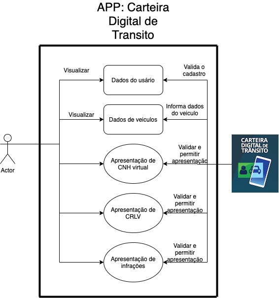
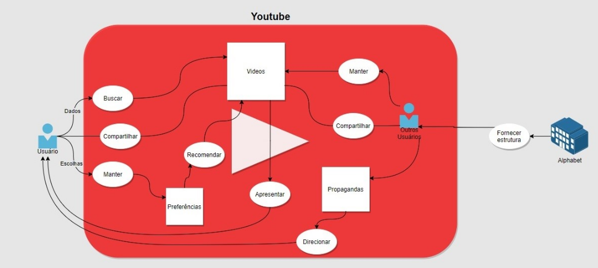
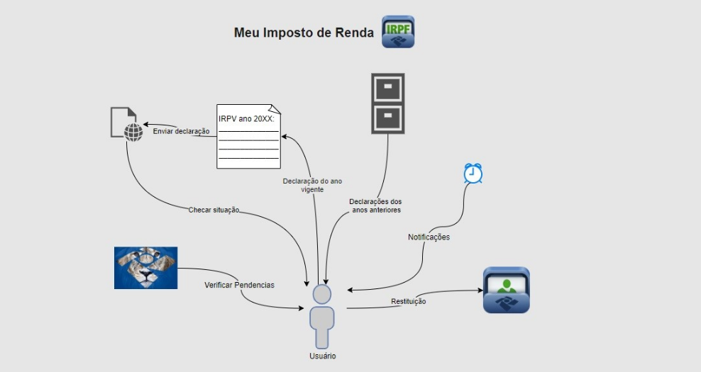
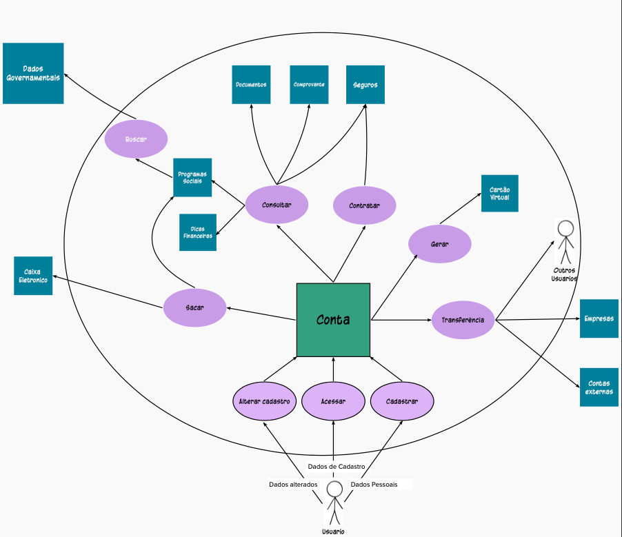

## Rich Picture

 Rich Picture e uma ferramenta para a representação visual simples, que pode de ser entendida por qualquer pessoa, das preocupações e relações dos usuários com uma aplicação.<a href="#Bibliografia">[1]</a>  
O grupo seguiu o seguinte fluxo de trabalho em relação aos Rich Pictures: 
    <ol>
    <li> Elaboração de Rich Pictures individuais, primeiramente para ganhar experiencia com a técnica, e também para propor ideias do tema do projeto. </li>
    <li> Discussão em grupo sobre a escolha do tema. </li>
    <li>Apos a escolha do tema, o grupo se reuniu para desenhar de forma colaborativa o Rich Picture do aplicativo selecionado.</li>
    <li>Melhorar o Rich Picture do projeto de forma incremental e colaborativa, de acordo com nossos aprendizados durante o desenvolvimento do projeto.</li>
    </ol>
 

## 1. Rich Pictures individuais

 Antes que fosse decidida definitivamente a escolha  do aplicativo alvo do projeto, cada integrante fez um Rich Picture de, ao menos, uma aplicação que considerava adequado para o escopo do projeto. <a href="#Bibliografia">[1][2]</a>

### 1.1 Antonio Aldísio

<figcaption>Figura 01 - Proposta de aplicativo - Carteira Digital de Trânsito. </figcaption>

### 1.2 Ariel Serafim

### 1.3 Fernando Calil

<figcaption>Figura 04 - Proposta de aplicativo - Youtube. </figcaption>

<figcaption>Figura 05 - Proposta de aplicativo - Meu Imposto de Renda.  </figcaption>

### 1.4 Lucas Lopes

### 1.5 Matheus Salim

### 1.6 Ugor Costa

## 2. Discussao para escolha do tema

## 3. Rich Picture colaborativo

<figcaption>Figura 03 - Rich Picture colaborativo versão 1.  </figcaption>

## Bibliografia 

 [1] MONK, Andrew; HOWARD, Steve. Methods & tools: the rich picture: a tool for resoning about work context. <strong>Interactions</strong>, York v.5, n.2, march./1998 

[2] http://systems.open.ac.uk/materials/T552/pages/rich/richAppendix.html

## Versionamento

| Versão | Data | Modificação | Autor |
|:--:|:--:|:--:|:--:|
| 1.0  | 03/08/2021 | Criação do rich picture  geral | Todos |
| 1.01 | 04/08/2021 | Inserir imagem da versão 1.0 do rich picture | Antônio Aldísio |
|   1.1 |   07/08/2021 | Adição de teoria sobre Rich Picture   Nova estruturação do conteudo   Adicionados Rich Pictures individuais |   Fernando Calil |
| 1.11 | 10/08/2021 | Inserir imagem do meu rich picture | Antônio Aldísio |

