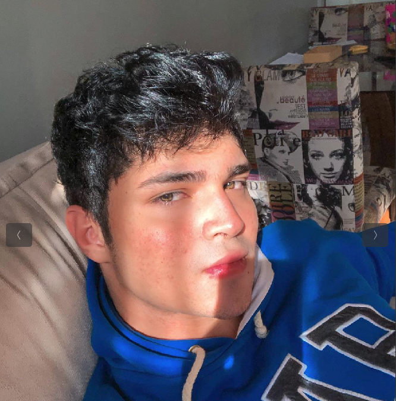

## Sobre o Projeto

 Repositório destinado à disciplina de Requisitos de Software sobre o aplicativo Caixa Tem com o professor Andre Barros de Sales.
Serão documentados os métodos e técnicas para levantamento e especificação de requisitos da aplicação selecionada.

## Sobre o Aplicativo 

 O CAIXA Tem é um aplicativo da CAIXA criado para facilitar o acesso de todos os brasileiros a serviços e transações bancárias de sua conta Poupança Digital Social.
Com o app é possível, consultar saldos e extratos, fazer pagamentos de contas e boletos, transferências e compras na internet utilizando o Cartão de Débito Virtual, gerado gratuitamente no próprio aplicativo. 
Ele também permite compras no comércio por meio de um QR Code gerado pelo lojista na própria maquininha do estabelecimento comercial. <a href="Bibliografia">[1]</a> 

## Integrantes 

| Foto | Nome | Github | email |
|: --- : | :--- : | :--- :   | :--- : |
||Antonio Aldísio | AntoonioAldisio | aldisiofilho@gmail.com |
||Ariel Serafim | ArielSixwings | arielserafim@gmail.com | 
||Fernando Calil |  FernandoMirandaC | 190106565@aluno.unb.br | 
||Lucas Gomes | LucasGlopes | lucasglpes@gmail.com | 
||Matheus Salim | matheussalimdeoliveira | matheussalimdeoliveira@gmail.com |
||Ugor Costa| ubrando | ugor_gost@hotmail.com |

## Bibliografia 

 [1] - https://www.caixa.gov.br/caixatem/Paginas/default.aspx 

## Versionamento

| Versão | Data | Modificação | Autor |
|--|--|--|--|
| 1.0 | 01/08/2021 | Criação do site | Antônio Aldisio |
| 1.01 | 02/08/2021 | Adiconar informaçōes sobre os Integrantes | Antônio Aldisio |
| 1.02 | 08/08/2021 | Melhorias no padrão de foto dos integrantes | Fernando Calil |

