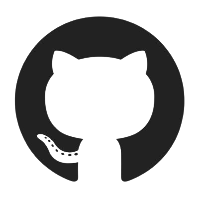

# Planejamento 
## 1. Aplicativos avaliados individualmente

 Cada integrante avaliou um aplicativo de seu interesse e alguns membros realizaram a análise do mesmo aplicativo como foi o caso da Carteira Digital de Trânsito. Ai temos os seguintes aplicativos avaliados:

- Youtube
- Caixa Tem
- Carteira Digital de Trânsito
- Hemovida
- PagMeia

Em consenso foi escolhido o Caixa tem.
# 2. Metodologia  

 A metodologia adotada pelo grupo foi SCRUM. As sprints serão de 1 semana conesecao a sprint 0 e 12 tem duaração de apenas 3 dias. Elas começa na segunda e termina no domingo. Preferencialmente a reunião semanal acontecerá na segunda, ou seja, o primeiro dia da nova sprint. 

## 2.1  Cronograma de atividades 

 Com as datas estipuladas pelo o professor foi levantado um cronograma das atividades a sem realizadas. Vale saleantar que as data podem ser alteradas ao decorrer do tempo.

|  Título|  Data de entrega |  Descrição|
|:------:|:-----------------------------:|:----------------------------------:|
| Pré-Rastreabilidade | 04/08 | Planejamento do projeto e RichPicture| 
| Elicitação de Requisitos | 21/08  | Técnicas e Priorização| 
| Modelagem de Requisitos | 30/08 | Cenários , Léxico, Use Case, Especificação Suplementar| 
| Modelagem de Requisitos - Ágil |11/09 | Histórias de Usuário, Backlogs, NFR Framework |
| Análise de Requisitos | 18/09 | Verificação e Validação | 
| Pós-Rastreabilidade | 09/10 | Gerência de Desenvolvimento de Software orientada à baseline de Requisitos | 
| Projeto final | 20/10 | Desenvolver a apresentação final do projeto | 

<figcaption>Tabela 1 - Cronograma de atividades</figcaption>

## 2.2  Cronograma das Sprints

| Sprint | Inicio| Termino | Backlog da sprint | 
|:------:|:-------------:|:--------------------:|:---------------------:|
| 0 | 29/07 | 01/08 | Escolha do Aplicativo, ferramentas e metodologia |  
| 1 | 02/08 | 08/08 | Montagem de wiki, Gravação da apresentação 1|  
| 2 | 09/08 | 15/08 | ---------- |  
| 3 | 16/08 | 22/08 | ---------- | 
| 4 | 23/08 | 29/08 | ---------- |
| 5 | 30/08 | 05/09 | ---------- | 
| 6 | 06/09 | 12/09 | ---------- | 
| 7 | 13/09 | 19/09 | ---------- | 
| 8 | 20/09 | 26/09 | ---------- | 
| 9 | 27/09 | 03/10 | ---------- | 
| 10 | 04/10 | 10/10 | ---------- | 
| 11 | 11/10 | 17/10 | ---------- | 
| 12 | 18/10 | 20/10 | ---------- | 

<figcaption>Tabela 2 - Cronograma das sprints </figcaption>

 Obs: Os Backlogs das sprints serão colocados ao longo do desenvolvimento do projeto.

## 2.3  Disponibilidade dos integrantes

 A figura 01 apresenta o quadro de disponbilidade geral dos integrantes do grupo.Obs: pode sofrer alteração ao longo do semestre.

<figcaption>Figura 01 - Quadro de disponibilidade geral dos integrantes </figcaption>

### 2.3.1  Disponibilidade intividual dos integrantes

<figcaption>Figura 02 - Quadro de disponibilidade do Antônio Aldisio </figcaption>

<figcaption>Figura 03 - Quadro de disponibilidade do Ariel Serafim </figcaption>

<figcaption>Figura 04 - Quadro de disponibilidade do Fernando Calil </figcaption>

<figcaption>Figura 05 - Quadro de disponibilidade do Lucas Lopes </figcaption>

<figcaption>Figura 06 - Quadro de disponibilidade do Matheus Salim </figcaption>

<figcaption>Figura 07 - Quadro de disponibilidade do Ugor Costa </figcaption>

# 3. Ferramentas Utilizadas

| Ferramenta | Nome | Descrição |
|:--:|:--:|:--:|
||<a href="https://play.google.com/store/apps/details?id=br.gov.caixa.tem" target="_blank">Caixa Tem| Aplicativo análisado por essa equipe |  
||<a href="https://github.com/Requisitos-de-Software/2021.1-Caixa_Tem" target="_blank">Github| Ferramenta de controle de versão de arquivos e código |  
||<a href="https://discord.com/" target="_blank">Discord| Ferramenta principal de reunião do grupo | 
||<a href="https://google.com/" target="_blank">Google Workspace| Ferramenta de compatilhamento de arquivo |  
||<a href="https://google.com/" target="_blank"> Teams| Ferramenta  de reunião do grupo e gravação de apresentaçōes |  
||<a href="https://web.whatapp.com/" target="_blank"> Whatsapp| Mensageiro principal do grupo para diálogo  |  
||<a href="https://youtube.com/" target="_blank"> Youtube| Plataforma de upload e visualização das apresentaçōes |  
||<a href="https://youtube.com/" target="_blank"> Mkdocs| Ferramenta gerador de site estático minimalista|  

## Bibliografia

 https://www.caixa.gov.br/caixatem/Paginas/default.aspx 

# Versionamento

| Versão | Data | Modificação | Autor |
|--|--|--|--|
| 1.0 | 01/08/2021 | Criação do site | Antônio Aldisio |
| 1.01 | 02/08/2021 | Adicionou o bloco de Metodologia, Aplicativos avaliados individualmente e Ferramentas Utilizadas| Antônio Aldisio |

