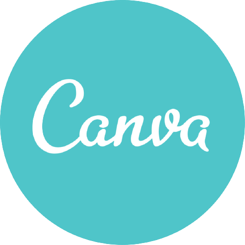

# Planejamento 
## 1. Aplicativos avaliados individualmente

 Cada integrante avaliou um aplicativo de seu interesse, alguns membros realizaram a análise do mesmo aplicativo, como foi o caso da Carteira Digital de Trânsito. Temos então os seguintes aplicativos avaliados:

- Youtube
- Caixa Tem
- Carteira Digital de Trânsito
- Hemovida
- PagMeia

Apos breve discussão o grupo optou pelo aplicativo <strong>Caixa Tem</strong>.
## 2. Metodologia  

 A metodologia adotada pelo grupo foi o metodo SCRUM. <a href="#Bibliografia">[1]</a> 

- Daliy: Todo dia via whatsapp;
- Reunião Semanal: <s>Segunda a noite</s> Sabado de manhã via discord;
- Tempo em média da sprint: 7 dias;

### 2.1  Cronograma de atividades 

 Conforme as datas estipuladas pelo professor foi levantado um cronograma das atividades a serem realizadas. Vale salientar que as datas podem ser alteradas ao decorrer do tempo.

|  Título|  Data de entrega |  Descrição|
|:------:|:-----------------------------:|:----------------------------------:|
| Pré-Rastreabilidade | 04/08 | Planejamento do projeto e RichPicture| 
| Elicitação de Requisitos | 21/08  | Técnicas e Priorização| 
| Modelagem de Requisitos | 30/08 | Cenários, Léxico, Use Case, Especificação Suplementar| 
| Modelagem de Requisitos - Ágil |11/09 | Histórias de Usuário, Backlogs, NFR Framework |
| Análise de Requisitos | 18/09 | Verificação e Validação | 
| Pós-Rastreabilidade | 09/10 | Gerência de Desenvolvimento de Software orientada à baseline de Requisitos | 
| Projeto final | 20/10 | Desenvolver a apresentação final do projeto | 

<figcaption>Tabela 1 - Cronograma de atividades</figcaption>

### 2.2  Cronograma das Sprints

| Sprint | Inicio| Termino | Backlog da sprint | 
|:------:|:-------------:|:--------------------:|:---------------------:|
| 0 | 29/07 | 01/08 | Escolha do Aplicativo, ferramentas e metodologia |  
| 1 | 02/08 | 08/08 | Montagem de wiki |  
| 2 | 10/08 | 16/08 | Questionário, Análise de Documentos, definição de técnicas de priorização (MoSCoW, Gráfico Tempo x Esforço), Tabela de argumentação e nova versão do Rich Picture |  
| 3 | 17/08 | 21/08 | Entrevista, Observação, Storytelling, Introspecção, Brainstorming, Priorização dos requisitos | 
| 4 | 22/08 | 27/08 | Revisão e Melhoria das técnias de Elicitação e Priorização. Léxico, Use Case, Especificação Suplementar, Cenários. |
| 5 | 28/08 | 03/09 | Desenvolvimento inicial das Histórias de Usuário, Backlog e NFR Framework | 
| 6 | 04/09 | 10/09 | Finalização dos artefatos de História de Usuário, Backlog  e NFR Framework | 
| 7 | 11/09 | 17/09 | Verificação e Validação dos artefados construidos pela equipe | 
| 8 | 18/09 | 24/09 | ---------- | 
| 9 | 25/09 | 01/10 | ---------- | 
| 10 | 02/10 | 08/10 | ---------- | 
| 11 | 09/10 | 15/10 | ---------- | 
| 12 | 16/10 | 20/10 | ---------- | 

<figcaption>Tabela 2 - Cronograma das sprints </figcaption>

 <strong>Obs</strong>: Os Backlogs das sprints serão atualizados ao longo do desenvolvimento do projeto.

## 3  Disponibilidade dos integrantes

 A figura 01 apresenta o quadro de disponbilidade geral dos integrantes do grupo.

<figcaption>Figura 01 - Quadro de disponibilidade geral dos integrantes </figcaption>

<strong>Obs</strong>: pode sofrer alteração ao longo do semestre.

### 3.1  Disponibilidade intividual dos integrantes

<figcaption>Figura 02 - Quadro de disponibilidade do Antônio Aldisio </figcaption>

<figcaption>Figura 03 - Quadro de disponibilidade do Ariel Serafim </figcaption>

<figcaption>Figura 04 - Quadro de disponibilidade do Fernando Calil </figcaption>

<figcaption>Figura 05 - Quadro de disponibilidade do Lucas Lopes </figcaption>

<figcaption>Figura 06 - Quadro de disponibilidade do Matheus Salim </figcaption>

<figcaption>Figura 07 - Quadro de disponibilidade do Ugor Costa </figcaption>

## 4. Ferramentas Utilizadas

| Ferramenta | Nome | Descrição |
|:--:|:--:|:--:|
||<a href="https://play.google.com/store/apps/details?id=br.gov.caixa.tem" target="_blank">CAIXA Tem| Aplicativo análisado por essa equipe |  
||<a href="https://github.com/Requisitos-de-Software/2021.1-Caixa_Tem" target="_blank">Github| Ferramenta de controle de versão de arquivos e código |  
||<a href="https://discord.com/" target="_blank">Discord| Ferramenta principal de reunião do grupo | 
||<a href="https://google.com/" target="_blank">Google Workspace| Ferramenta de compatilhamento de arquivo |  
||<a href="https://google.com/" target="_blank">Microsoft Teams| Ferramenta  de reunião do grupo e gravação de apresentaçōes |  
||<a href="https://web.whatapp.com/" target="_blank"> WhatsApp| Mensageiro principal do grupo para diálogo  |  
||<a href="https://youtube.com/" target="_blank"> Youtube| Plataforma de upload e visualização das apresentaçōes |  
||<a href="https://www.mkdocs.org/" target="_blank"> Mkdocs| Ferramenta gerador de site estático minimalista|  
||<a href="https://squidfunk.github.io/mkdocs-material/" target="_blank"> Mkdocs - Material| Tema para a página|
||<a href="https://www.canva.com/" target="_blank"> Canva| Ferramenta para criação da apresentação|  

## Bibliografia 

 [1] - LEFFINGWELL, Dean; <strong>Agile Software Requirements</strong>: Lean Requirements Practices for Teams, Programs, and Enterprise. 1. ed. Boston: Pearson, 2011. 

## Versionamento

| Versão | Data | Modificação | Autor |
|--|--|--|--|
| 1.0 | 01/08/2021 | Criação do site | Antônio Aldisio |
| 1.01 | 02/08/2021 | Adicionou o bloco de Metodologia, Aplicativos avaliados individualmente e Ferramentas Utilizadas| Antônio Aldisio |
| 1.05 | 08/08/2021 | Ajuste de texto  Adicionada referência teórica | Fernando Calil |
| 1.06 | 26/08/2021 | Adicionada ferramenta de criação da apresentação. Adaptação e atualização do cronograma. | Fernando Calil |
| 1.07 | 11/09/2021 | Atualização do Cronograma de sprints de acordo com o andamento do projeto. | Fernando Calil |

